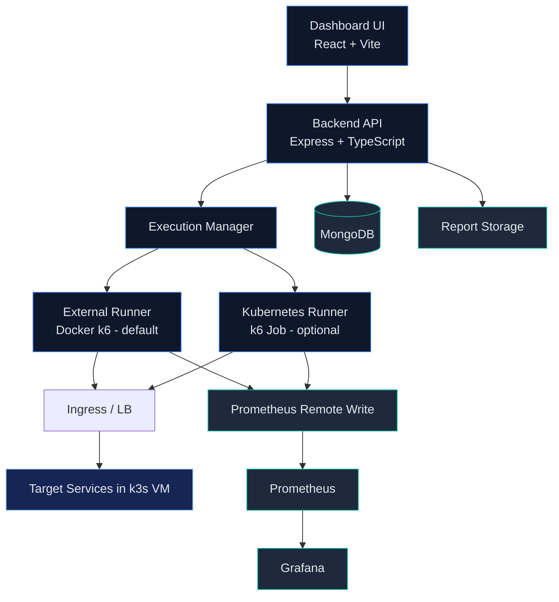

# 2. Architecture Diagram

### Resource Strategy
- Application under test is inside a constrained VM (8 CPU / 16 GB RAM).
- Load generation stays outside the VM by default to avoid stealing CPU and memory.
